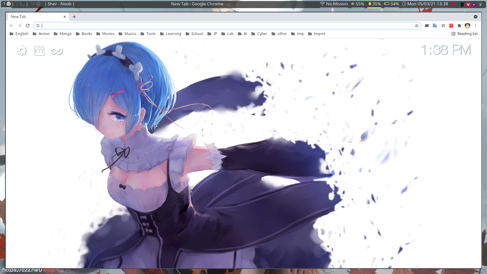
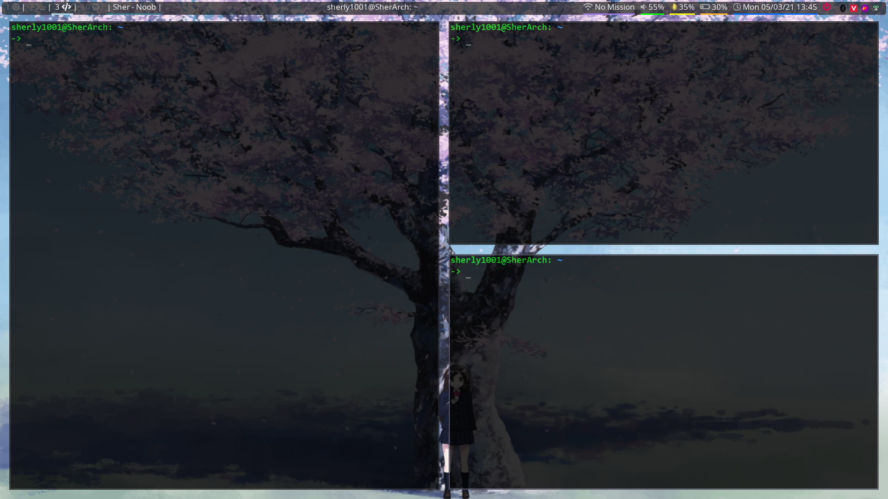
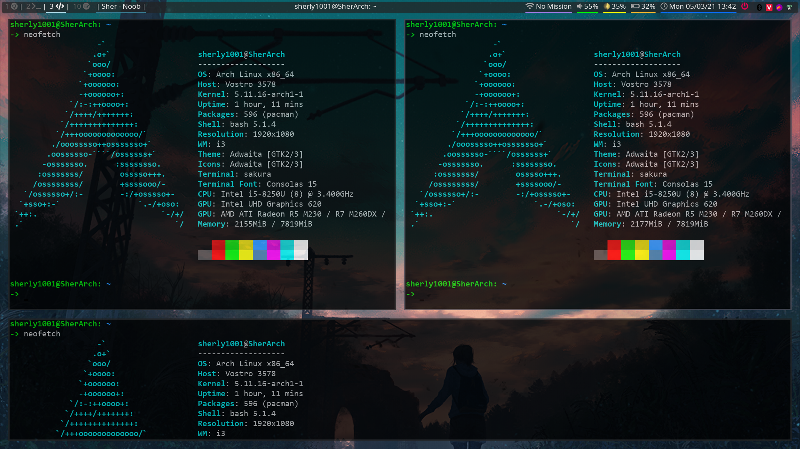
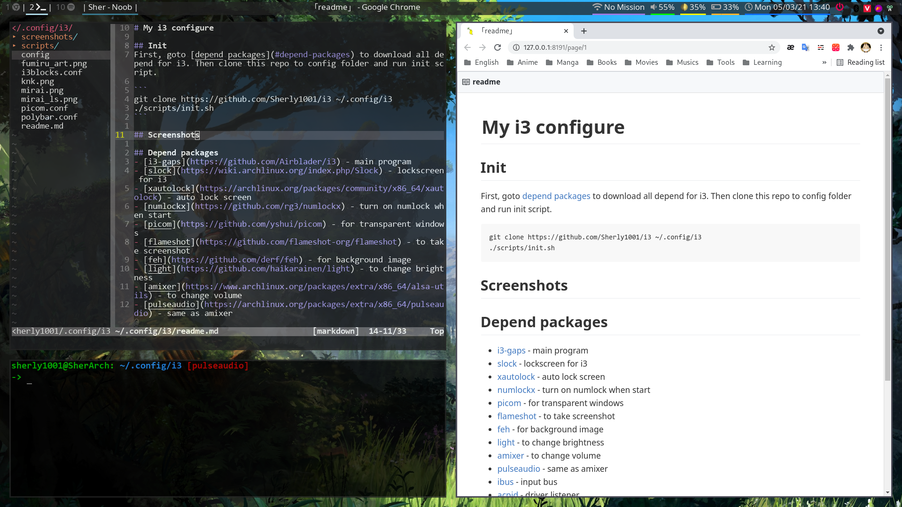

# My i3 configure

## Init
First, goto [depend packages](#depend-packages) to download all depend for i3. Then clone this repo to config folder and run init script.

```
git clone https://github.com/Sherly1001/i3 ~/.config/i3
./scripts/init.sh
```

## Screenshots






## Depend packages
- [i3-gaps](https://github.com/Airblader/i3) - main program
- [slock](https://wiki.archlinux.org/index.php/Slock) - lockscreen for i3
- [xautolock](https://archlinux.org/packages/community/x86_64/xautolock) - auto lock screen
- [numlockx](https://github.com/rg3/numlockx) - turn on numlock when start
- [picom](https://github.com/yshui/picom) - for transparent windows
- [flameshot](https://github.com/flameshot-org/flameshot) - to take screenshot
- [polybar](https://github.com/polybar/polybar) - system bar
- [feh](https://github.com/derf/feh) - for background image
- [light](https://github.com/haikarainen/light) - to change brightness
- [amixer](https://www.archlinux.org/packages/extra/x86_64/alsa-utils) - to change volume
- [pulseaudio](https://archlinux.org/packages/extra/x86_64/pulseaudio) - same as amixer
- [ibus](https://www.archlinux.org/packages/extra/x86_64/ibus) - input bus
- [acpid](https://www.archlinux.org/packages/community/x86_64/acpid) - driver listener
- [rofi](https://archlinux.org/packages/community/x86_64/rofi) - application launcher
- [dunst](https://archlinux.org/packages/community/x86_64/dunst) - notification daemon
- [sakura](https://archlinux.org/packages/community/x86_64/sakura) - terminal

## Font families
- [consolas-font](https://aur.archlinux.org/packages/consolas-font)
- [ttf-joypixels](https://www.archlinux.org/packages/community/any/ttf-joypixels)
- [ttf-font-awesome](https://www.archlinux.org/packages/community/any/ttf-font-awesome/)
- [noto-fonts](https://www.archlinux.org/packages/extra/any/noto-fonts)
